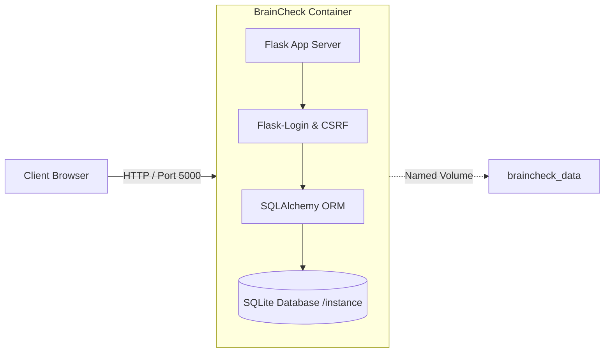
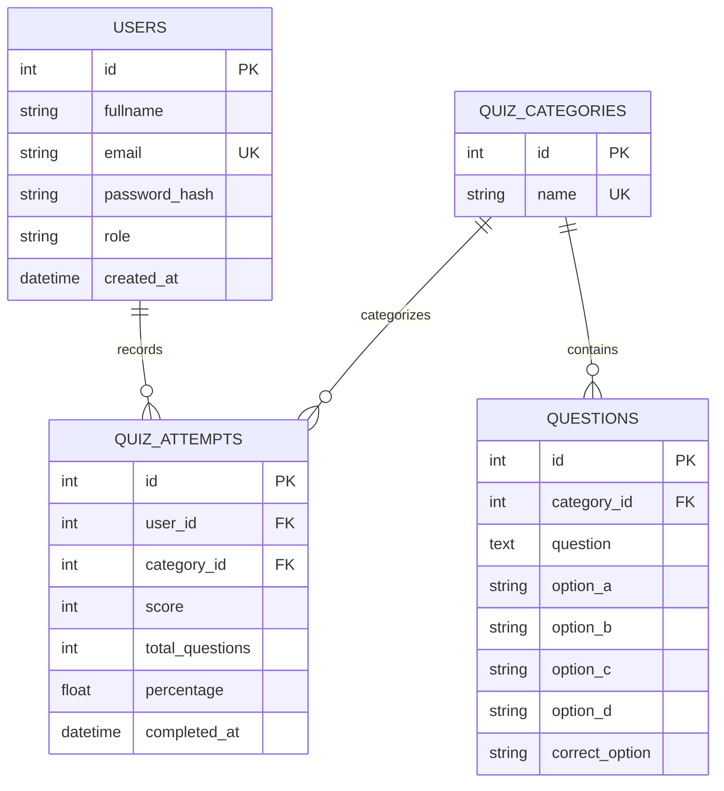
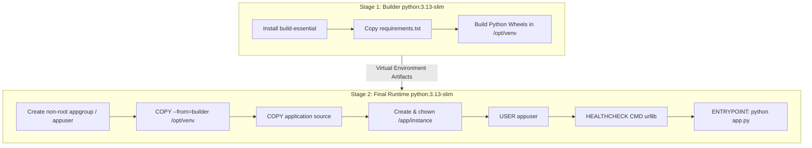
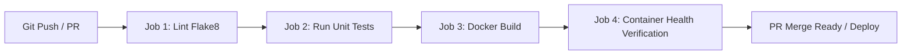

# 🧠 BrainCheck — Dockerized MCQ Quiz Platform

[](https://python.org)
[](https://flask.palletsprojects.com/)
[](https://docker.com)
[](https://docs.docker.com/compose/)
[](https://getbootstrap.com)
[](https://sqlite.org)
[](https://github.com/features/actions)
[](LICENSE)

A production-ready, fully containerized Multiple-Choice Question (MCQ) quiz platform built with **Python 3.13**, **Flask 3.x**, **Flask-SQLAlchemy**, **Flask-Login**, **Flask-WTF**, and **Bootstrap 5.3**. Deployed via secure **multi-stage Docker builds** and managed with **Docker Compose**.

---

## 📑 Table of Contents

- [Overview](#-overview)
- [System Architecture](#-system-architecture)
- [Key Features](#-key-features)
  - [Student Experience](#student-experience)
  - [Admin Control Center](#admin-control-center)
  - [Security Architecture](#security-architecture)
  - [Container & DevOps Excellence](#container--devops-excellence)
- [Tech Stack](#-tech-stack)
- [Quick Start Guide](#-quick-start-guide)
  - [Option 1: Docker Compose (Recommended)](#option-1-docker-compose-recommended)
  - [Option 2: Docker CLI Direct](#option-2-docker-cli-direct)
  - [Option 3: Local Python Virtual Environment](#option-3-local-python-virtual-environment)
  - [Option 4: Windows One-Click Batch Scripts](#option-4-windows-one-click-batch-scripts)
- [Default Credentials & Auto-Seeding](#-default-credentials--auto-seeding)
- [Project Directory Structure](#-project-directory-structure)
- [Database Schema & Models](#-database-schema--models)
- [Routes & API Blueprint Reference](#-routes--api-blueprint-reference)
- [Configuration & Environment Variables](#-configuration--environment-variables)
- [Docker Architecture & Multi-Stage Builds](#-docker-architecture--multi-stage-builds)
- [CI/CD Automation Pipeline](#-cicd-automation-pipeline)
- [Testing & Quality Assurance](#-testing--quality-assurance)
- [Production Deployment Recommendations](#-production-deployment-recommendations)
- [Troubleshooting & FAQs](#-troubleshooting--faqs)
- [Documentation Index](#-documentation-index)
- [Credits & Academic Context](#-credits--academic-context)

---

## 🌟 Overview

**BrainCheck** is an interactive, enterprise-grade assessment platform designed for educators, students, and developer training. It delivers a fast, responsive user interface with automated question shuffling, real-time countdown timers, instant scoring with comprehensive answer breakdowns, and aggregate visual analytics.

Administrators have access to a protected portal offering full CRUD operations over quiz topics, dynamic questions, student registries, and historic performance logs.



---

## 🏛 System Architecture

BrainCheck utilizes the **Application Factory Pattern** with modular Flask **Blueprints** to maintain a clean separation of concerns across authentication, dashboard analytics, quiz engine state, and administrative operations.

```mermaid
graph TD
    Client([User Browser])

    subgraph Presentation & Routing Layer
        AuthBP[auth_bp: /auth]
        MainBP[main_bp: /dashboard]
        QuizBP[quiz_bp: /quiz]
        AdminBP[admin_bp: /admin]
    end

    subgraph Middleware & Security
        LoginMgr[Flask-Login]
        CSRFMgr[Flask-WTF CSRF]
        AdminGuard[@admin_required Guard]
    end

    subgraph Data & Persistence Layer
        ORM[Flask-SQLAlchemy]
        DB[(SQLite /app/instance/database.db)]
    end

    Client -->|Register / Login| AuthBP
    Client -->|Analytics / Overview| MainBP
    Client -->|Timed Assessments| QuizBP
    Client -->|Management| AdminGuard --> AdminBP

    AuthBP --> LoginMgr
    MainBP --> LoginMgr
    QuizBP --> LoginMgr
    AdminBP --> LoginMgr

    AuthBP & MainBP & QuizBP & AdminBP --> CSRFMgr
    AuthBP & MainBP & QuizBP & AdminBP --> ORM --> DB
```

---

## ✨ Key Features

### Student Experience
- **Secure Authentication**: User registration and login protected with PBKDF2 SHA-256 password hashing.
- **Topic Exploration**: Browse categorized quizzes including Python, Docker, JavaScript, and General Knowledge with real-time question counters.
- **Randomized Question Engine**: Questions are automatically shuffled on quiz initiation, storing randomized order within secure session state.
- **Configurable Countdown Timer**: Visual timer with auto-submit mechanisms when the countdown expires.
- **Paginated Navigation**: Step forward and backward through questions with automatic state preservation.
- **Instant Detailed Feedback**: Post-quiz performance scorecard featuring percentage score, question-by-question breakdown, and correct answer displays.
- **Historical Scorecard & Charts**: Interactive student dashboard tracking total quizzes, average score, personal best, and recent attempt logs.

### Admin Control Center
- **Protected Administrative Guard**: Role-based access control (`@admin_required`) restricting unauthorized access.
- **Executive Analytics**: Global metrics for total users, admins, categories, questions, attempts, and platform-wide average score.
- **Category Management**: Create, view, and safely cascade-delete quiz categories.
- **MCQ Question Builder**: Add, edit, filter, and delete 4-option MCQs with dynamic category assignment.
- **User Directory**: Inspect all registered student accounts and timestamps.
- **Global Attempt Logs**: View performance records, scores, and timestamps across the entire student base.

### Security Architecture
- **Password Protection**: Salting and hashing powered by Werkzeug's PBKDF2 implementation.
- **CSRF Token Validation**: Strict CSRF token verification across all POST actions via `Flask-WTF`.
- **Session Hardening**: HTTPOnly, SameSite (Lax), and configurable Secure cookie flags.
- **Non-Root Container Execution**: Dedicated `appuser` system user preventing container breakout privilege escalation.
- **Defense in Depth**: Zero host dependencies, isolated virtual environment, and sanitized user inputs.

### Container & DevOps Excellence
- **Multi-Stage Dockerfile**: Builder stage isolates compilation dependencies; final lean runtime image reduces attack surface and footprint.
- **Named Volume Persistence**: Persistent SQLite database storage mounted to `braincheck_data`.
- **Docker Healthcheck**: Built-in container health checks verifying application responsiveness.
- **Automated CI/CD**: GitHub Actions workflows for Flake8 linting, unittest execution, and automated Docker build & run verification.

---

## 🛠 Tech Stack

| Domain | Technology | Purpose / Role |
|---|---|---|
| **Language** | Python 3.13 | Core runtime environment |
| **Framework** | Flask 3.x | Lightweight, flexible WSGI web framework |
| **ORM / Database** | Flask-SQLAlchemy / SQLite | Relational schema and persistent data storage |
| **User Authentication** | Flask-Login + Werkzeug | User session handling and cryptographic password hashing |
| **Form Security** | Flask-WTF / CSRFProtect | Cross-Site Request Forgery mitigation |
| **Frontend UI** | Bootstrap 5.3 + Bootstrap Icons | Modern, mobile-responsive styling and typography |
| **Data Visualization** | HTML5 Canvas / Vanilla JS | Score progression and performance indicators |
| **Containerization** | Docker (Multi-Stage) | Secure, lightweight container packaging |
| **Orchestration** | Docker Compose v2 | Multi-container and volume configuration |
| **Continuous Integration** | GitHub Actions | Automated linting, test suite execution, and container verification |

---

## 🚀 Quick Start Guide

### Option 1: Docker Compose (Recommended)

The fastest and most reliable way to launch BrainCheck:

```bash
# 1. Clone the repository
git clone https://github.com/Priya-Ranjan-0201/BrainCheck.git
cd BrainCheck

# 2. Build image and run container in detached mode
docker compose up -d --build

# 3. View live application logs
docker compose logs -f web
```

Access the application in your browser: **[http://localhost:5000](http://localhost:5000)**

To stop the application:
```bash
docker compose down
```

---

### Option 2: Docker CLI Direct

Build and run using standard Docker commands:

```bash
# Build the Docker image
docker build -t braincheck:latest .

# Run the container with a persistent volume
docker run -d \
  --name braincheck_app \
  -p 5000:5000 \
  -v braincheck_data:/app/instance \
  -e SECRET_KEY="custom-production-secret-key" \
  braincheck:latest
```

---

### Option 3: Local Python Virtual Environment

Run without Docker for local development:

```bash
# 1. Clone and enter the directory
git clone https://github.com/Priya-Ranjan-0201/BrainCheck.git
cd BrainCheck

# 2. Create and activate a virtual environment
python -m venv .venv
# On Windows (PowerShell / CMD):
.venv\Scripts\activate
# On macOS / Linux:
# source .venv/bin/activate

# 3. Install requirements
pip install --upgrade pip
pip install -r requirements.txt

# 4. (Optional) Configure environment variables
# cp .env.example .env

# 5. Start the Flask development server
flask run --host=0.0.0.0 --port=5000
# Or directly via Python:
# python app.py
```

Access the application: **[http://127.0.0.1:5000](http://127.0.0.1:5000)**

---

### Option 4: Windows One-Click Batch Scripts

For Windows users, convenient batch scripts are provided in the repository root:

- **Local Python Mode**: Double-click `run.bat` (creates `.venv`, installs requirements, and runs Flask).
- **Docker Compose Mode**: Double-click `run_docker.bat` (executes `docker compose up -d --build` with status messages).

---

## 🔑 Default Credentials & Auto-Seeding

On first startup, BrainCheck automatically initializes the SQLite database schema and seeds default topics, sample questions, and a pre-configured administrator account.

| Role | Email | Default Password | Dashboard Route |
|---|---|---|---|
| **Admin** | `admin@braincheck.com` | `Admin@123` | `/admin` |
| **Student** | *Create via Registration* | *User Defined* | `/dashboard` |

> [!IMPORTANT]
> Change the admin password before deploying to public or production environments by updating the `ADMIN_PASSWORD` variable in `.env` or `docker-compose.yml`.

---

## 📂 Project Directory Structure

```
BrainCheck/
├── .dockerignore                 # Excludes caches, venvs, and Git files from Docker builds
├── .env.example                  # Template configuration for environment variables
├── .gitignore                    # Git file exclusion rules
├── Dockerfile                    # Secure multi-stage production Docker build
├── docker-compose.yml            # Docker Compose orchestration definition
├── requirements.txt              # Production Python package dependencies
├── config.py                     # Centralized application configuration
├── app.py                        # App factory, extension wiring & database seeder
├── run.bat                       # Windows 1-click launcher for local Python
├── run_docker.bat                # Windows 1-click launcher for Docker Compose
├── README.md                     # Comprehensive project documentation
│
├── .github/
│   └── workflows/
│       ├── ci.yml                # GitHub Actions CI workflow (tests + Docker build)
│       └── docker-ci.yml         # Advanced multi-stage CI pipeline (Lint + Test + Container Health)
│
├── docs/                         # In-depth architectural & deployment guides
│   ├── ARCHITECTURE.md           # System design, data flow & security specs
│   ├── API_AND_ROUTES.md         # Full endpoint catalog and request specifications
│   ├── DOCKER_GUIDE.md           # Container optimization, security & caching guide
│   └── CONTRIBUTING.md           # Developer guidelines, linting & PR workflows
│
├── models/
│   ├── __init__.py               # Models package initialization
│   └── models.py                 # SQLAlchemy ORM models (User, QuizCategory, Question, QuizAttempt)
│
├── routes/
│   ├── __init__.py               # Blueprint exports
│   ├── auth.py                   # Authentication routes (/auth/login, /auth/register, /auth/logout)
│   ├── main.py                   # Dashboard and overview metrics (/dashboard)
│   ├── quiz.py                   # Quiz engine, session management & scoring (/quiz/*)
│   └── admin.py                  # Admin dashboard & CRUD operations (/admin/*)
│
├── templates/                    # Jinja2 HTML templates
│   ├── base.html                 # Master layout with responsive navbar, flashes & footer
│   ├── auth/                     # login.html, register.html
│   ├── main/                     # dashboard.html
│   ├── quiz/                     # categories.html, quiz.html, result.html, attempts.html
│   └── admin/                    # dashboard.html, categories.html, questions.html,
│                                 # add_question.html, edit_question.html, users.html, attempts.html
│
├── static/
│   ├── css/
│   │   └── style.css             # Custom styling, cards, timer UI, badges
│   └── js/
│       └── main.js               # Timer engine, chart rendering, flash auto-dismiss
│
└── tests/
    ├── __init__.py               # Tests package initialization
    └── test_app.py               # Automated unit tests (auth, routing, admin guards, seeds)
```

---

## 🗄 Database Schema & Models

BrainCheck uses **Flask-SQLAlchemy** with relational integrity constraints and cascading deletions:



---

## 🚦 Routes & API Blueprint Reference

### 🔐 Authentication (`/auth`)
| Route | Method | Access | Description |
|---|---|---|---|
| `/auth/register` | `GET`, `POST` | Public | Register a new student account |
| `/auth/login` | `GET`, `POST` | Public | Authenticate user and redirect to appropriate dashboard |
| `/auth/logout` | `GET` | Authenticated | Terminate session and redirect to login |

### 📊 Student Dashboard (`/dashboard`)
| Route | Method | Access | Description |
|---|---|---|---|
| `/dashboard/` | `GET` | Authenticated | View student performance stats, recent quiz attempts & categories |

### 🎯 Quiz Engine (`/quiz`)
| Route | Method | Access | Description |
|---|---|---|---|
| `/quiz/categories` | `GET` | Authenticated | Browse available quiz categories |
| `/quiz/start/<category_id>` | `GET` | Authenticated | Initialize randomized quiz session & timer |
| `/quiz/take` | `GET`, `POST` | Authenticated | Render active question & handle previous/next navigation |
| `/quiz/submit` | `GET`, `POST` | Authenticated | Calculate score, persist `QuizAttempt`, and redirect to results |
| `/quiz/result` | `GET` | Authenticated | Display scorecard, score percentage, and answer review |
| `/quiz/attempts` | `GET` | Authenticated | Display personal historical attempt logs |

### 🛡 Admin Control Center (`/admin`)
| Route | Method | Access | Description |
|---|---|---|---|
| `/admin/` | `GET` | Admin Only | System-wide statistics and activity summary |
| `/admin/categories` | `GET`, `POST` | Admin Only | List all categories and create a new category |
| `/admin/categories/delete/<id>` | `POST` | Admin Only | Delete category (cascades questions & attempts) |
| `/admin/questions` | `GET` | Admin Only | List questions with category filter |
| `/admin/questions/add` | `GET`, `POST` | Admin Only | Create a new MCQ question |
| `/admin/questions/edit/<id>` | `GET`, `POST` | Admin Only | Update existing question details and options |
| `/admin/questions/delete/<id>` | `POST` | Admin Only | Delete a question |
| `/admin/users` | `GET` | Admin Only | View all registered platform users |
| `/admin/attempts` | `GET` | Admin Only | View system-wide attempt history and scores |

---

## ⚙ Configuration & Environment Variables

All parameters can be configured via environment variables or `.env`:

| Variable | Default Value | Description |
|---|---|---|
| `FLASK_APP` | `app.py` | Entrypoint script for Flask CLI |
| `FLASK_ENV` | `production` | Environment mode (`development`, `production`, `testing`) |
| `FLASK_DEBUG` | `False` | Enables Flask debug mode (Keep `False` in production) |
| `FLASK_HOST` | `0.0.0.0` | Server binding host IP |
| `FLASK_PORT` / `PORT` | `5000` | Server listening port |
| `SECRET_KEY` | `braincheck-secret-key-change-me` | Cryptographic secret for session cookies & CSRF tokens |
| `DATABASE_URL` | `sqlite:///instance/database.db` | SQLAlchemy database connection URI |
| `QUIZ_TIME_LIMIT` | `300` | Default time allowed per quiz in seconds (5 minutes) |
| `ADMIN_EMAIL` | `admin@braincheck.com` | Email address for pre-seeded administrator |
| `ADMIN_PASSWORD` | `Admin@123` | Password for pre-seeded administrator |
| `SESSION_COOKIE_SECURE` | `False` | Enforce HTTPS-only cookie transmission (Set `True` behind SSL) |
| `SESSION_COOKIE_HTTPONLY` | `True` | Mitigate XSS cookie theft |
| `SESSION_COOKIE_SAMESITE` | `Lax` | SameSite cookie policy (`Lax`, `Strict`, `None`) |

---

## 🐳 Docker Architecture & Multi-Stage Builds

The container build is optimized for security, performance, and minimal image size using a **2-Stage Multi-Stage Build**:



### Key Container Features:
1. **Layer Caching**: `requirements.txt` is copied and installed prior to copying source code, ensuring instant rebuilds when only application code changes.
2. **Lean Runtime**: Compilers and package caches are stripped from the final stage, keeping image footprint minimal.
3. **Non-Root Execution**: Runs under UID `appuser:appgroup` for defense-in-depth security.
4. **Automated Healthcheck**: Tests `http://localhost:5000/` every 30 seconds to allow Docker Swarm / Kubernetes / Compose auto-recovery.

---

## 🔄 CI/CD Automation Pipeline

BrainCheck includes production GitHub Actions workflows in `.github/workflows/`:



1. **Linting (`flake8`)**: Verifies Python syntax integrity, clean code conventions, and imports.
2. **Automated Testing (`unittest`)**: Runs full integration and unit test suite against an in-memory test database.
3. **Docker Build**: Builds container image with multi-stage caching enabled.
4. **Container Healthcheck Verification**: Spins up the container in CI, awaits database seeding, tests HTTP 200/302 responses via `curl`, and checks container health.

---

## 🧪 Testing & Quality Assurance

BrainCheck includes a comprehensive automated test suite built with Python's built-in `unittest` framework.

### Running Tests Locally:

```bash
# Inside your activated virtual environment:
python -m unittest discover -s tests -p "test_*.py" -v
```

### Verified Test Cases:
- `test_index_redirects_to_dashboard`: Ensures root route `/` correctly redirects to dashboard/login.
- `test_database_category_seed`: Verifies default categories (Python, Docker, JS, GK) and questions are seeded on boot.
- `test_user_registration`: Tests user creation, password hashing, and database storage.
- `test_user_login_validation`: Validates credential matching, rejection of invalid passwords, and session creation.
- `test_dashboard_unauthenticated_redirect`: Verifies protected student dashboard redirects unauthenticated users.
- `test_admin_route_protection_by_default`: Asserts normal users receive HTTP 302 access denials when requesting `/admin` endpoints.

---

## 🚢 Production Deployment Recommendations

When transitioning from local development to public production:

1. **WSGI Production Server**: Swap Flask's built-in server for **Gunicorn**:
   ```bash
   pip install gunicorn
   gunicorn -w 4 -b 0.0.0.0:5000 "app:create_app()"
   ```
2. **Reverse Proxy & SSL**: Place **Nginx** or **Traefik** in front of the container to terminate SSL/TLS certificates (Let's Encrypt).
3. **Cookie Hardening**: Set `SESSION_COOKIE_SECURE=True` in `.env` once running under HTTPS.
4. **Database Scaling**: For larger deployments, replace SQLite with PostgreSQL or MySQL by configuring the `DATABASE_URL` connection string.

---

## ❓ Troubleshooting & FAQs

<details>
<summary><b>Q: How do I reset the database or re-seed default data?</b></summary>

Simply stop the container, delete the local instance file or Docker volume, and restart:
```bash
docker compose down -v
docker compose up -d --build
```
</details>

<details>
<summary><b>Q: I cannot log in with the admin account.</b></summary>

Check your `.env` or `docker-compose.yml` file for `ADMIN_EMAIL` and `ADMIN_PASSWORD`. By default, credentials are `admin@braincheck.com` / `Admin@123`.
</details>

<details>
<summary><b>Q: How do I change the quiz duration?</b></summary>

Modify the `QUIZ_TIME_LIMIT` variable in `.env` (value in seconds). For example, `QUIZ_TIME_LIMIT=600` grants 10 minutes per quiz.
</details>

<details>
<summary><b>Q: Port 5000 is already in use on my machine.</b></summary>

Change the host port mapping in `docker-compose.yml`:
```yaml
ports:
  - "8080:5000"
```
Then access the app at `http://localhost:8080`.
</details>

---

## 📚 Documentation Index

For detailed technical guides, explore the `docs/` folder:

- **[Summer Training / Internship Report (Academic)](docs/SUMMER_TRAINING_REPORT.md)** — Complete formal Capstone Project report in standard academic format.
- **[System Architecture Guide](docs/ARCHITECTURE.md)** — Deep dive into system design, data flows, and security model.
- **[API & Route Catalog](docs/API_AND_ROUTES.md)** — Comprehensive parameter and endpoint reference.
- **[Docker Deployment & Container Guide](docs/DOCKER_GUIDE.md)** — Multi-stage builds, volume management, and security.
- **[Contributing & Code Standards](docs/CONTRIBUTING.md)** — Developer onboarding, style guides, and PR process.

---

## 🎓 Credits & Academic Context

This application was developed as a **Capstone Project** for **B.Tech Computer Science and Engineering (CSE)** at **Lovely Professional University (LPU)**.

- **Developer & Maintainer**: [Priya Ranjan](https://github.com/Priya-Ranjan-0201)
- **Project Repository**: [GitHub — BrainCheck](https://github.com/Priya-Ranjan-0201/BrainCheck)

---

<div align="center">
  <sub>Built with ❤️ for learners, educators, and containerization enthusiasts.</sub>
</div>
