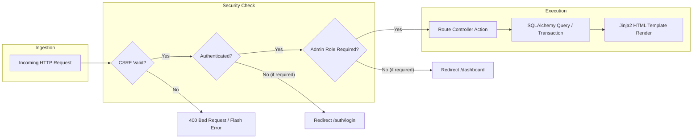
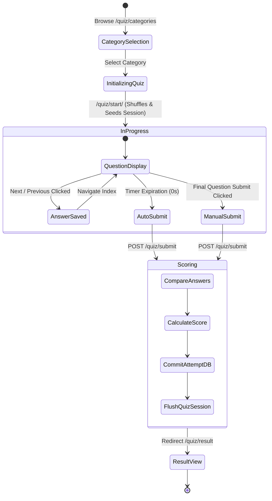

# 🏛 BrainCheck System Architecture

This document details the software architecture, design patterns, component relationships, data flow, state management, and security model of the **BrainCheck** containerized quiz application.

---

## 📑 Table of Contents

- [Architectural Overview](#architectural-overview)
- [Design Patterns](#design-patterns)
- [System Component Breakdown](#system-component-breakdown)
- [End-to-End Data Flow](#end-to-end-data-flow)
- [Session State & Quiz Lifecycle](#session-state--quiz-lifecycle)
- [Database Relational Model](#database-relational-model)
- [Security Model & Threat Mitigation](#security-model--threat-mitigation)
- [Non-Functional Requirements & Scalability](#non-functional-requirements--scalability)

---

## Architectural Overview

BrainCheck is structured as a **monolithic modular web application** utilizing a layered architectural model with server-side Jinja2 template rendering, REST-like form dispatch, relational ORM mapping, and isolated container execution.

```mermaid
graph TD
    subgraph Client Layer
        Browser[Client Web Browser]
        JS[Vanilla JavaScript + Canvas UI]
        CSS[Bootstrap 5.3 + Custom CSS]
    end

    subgraph Container Boundary [Docker Runtime - Port 5000]
        subgraph Routing & Controller Layer
            AppFactory[Flask Application Factory: create_app]
            AuthBP[Auth Blueprint: /auth]
            MainBP[Main Blueprint: /dashboard]
            QuizBP[Quiz Blueprint: /quiz]
            AdminBP[Admin Blueprint: /admin]
        end

        subgraph Middleware & Cross-Cutting Concerns
            LoginManager[Flask-Login Session Auth]
            CSRFProtection[Flask-WTF CSRF Token Validator]
            AdminDecorator[@admin_required RBAC Decorator]
            ConfigModule[config.py Environment Loader]
        end

        subgraph Domain & Persistence Layer
            ORM[Flask-SQLAlchemy ORM]
            Models[User | QuizCategory | Question | QuizAttempt]
        end
    end

    subgraph Storage Layer [Docker Named Volume]
        SQLiteFile[(database.db /app/instance)]
    end

    Browser <-->|HTTP GET / POST| AppFactory
    AppFactory --> AuthBP & MainBP & QuizBP & AdminBP
    AuthBP & MainBP & QuizBP & AdminBP --> LoginManager
    AuthBP & MainBP & QuizBP & AdminBP --> CSRFProtection
    AdminBP --> AdminDecorator
    AuthBP & MainBP & QuizBP & AdminBP --> ORM
    ORM --> Models
    Models --> SQLiteFile
```

---

## Design Patterns

### 1. Application Factory Pattern (`create_app`)
- The application is constructed dynamically through the `create_app()` function in `app.py`.
- Enables dynamic configuration switching (e.g., swapping between `Config` and `TestingConfig` with in-memory SQLite during automated test execution).
- Encapsulates extension initialization (`db.init_app`, `login_manager.init_app`, `csrf.init_app`) avoiding global state leakage.

### 2. Blueprint Modularization
- Functionality is decoupled into four isolated blueprints:
  - `auth_bp`: Handles credential submission, hashing, session registration, and teardown.
  - `main_bp`: Computes aggregate statistics and renders user-specific dashboards.
  - `quiz_bp`: Controls question shuffling, active assessment navigation, countdown timing, and score persistence.
  - `admin_bp`: Restricts administrative routes, category management, question creation/editing, and user audit logs.

### 3. Role-Based Access Control (RBAC) Decorator
- Custom decorator `@admin_required` in `routes/admin.py` wraps endpoints:
  - Verifies user authentication via `@login_required`.
  - Asserts `current_user.is_admin` property (`user.role == "admin"`).
  - Emits access denial flash message and redirects unauthorized users to `/dashboard`.

---

## System Component Breakdown



---

## End-to-End Data Flow

### 1. Authentication Flow
1. Student submits email and plain password via POST to `/auth/login`.
2. Flask-WTF validates CSRF token authenticity.
3. Controller retrieves `User` record via `User.query.filter_by(email=email).first()`.
4. `check_password_hash(user.password_hash, password)` checks credentials using PBKDF2.
5. If valid, `login_user(user, remember=remember)` creates an encrypted session cookie.
6. The user is redirected to the role-appropriate landing view (`/admin` or `/dashboard`).

### 2. Quiz Session Flow
1. Student selects a category at `/quiz/start/<category_id>`.
2. Backend queries all `Question` entities matching the category ID.
3. Python `random.shuffle()` randomizes question ordering.
4. Active quiz state (question IDs array, empty answers dictionary, current pointer index, time limit, and start timestamp) is stored in the signed Flask session.
5. Client navigates sequentially through `/quiz/take`, saving radio-button selections across question indexes via POST requests.
6. Upon final submission or timer expiration, `/quiz/submit` compares submitted answers against database truth, computes score percentage, writes `QuizAttempt` to database, cleans session keys, and presents the result review.

---

## Session State & Quiz Lifecycle



---

## Database Relational Model

The database contains four tables linked with primary-foreign key relationships and explicit cascading rules:

| Table | Primary Key | Foreign Keys | Key Columns | Cascading Rule |
|---|---|---|---|---|
| `users` | `id` (Integer) | None | `fullname`, `email` (UK), `password_hash`, `role`, `created_at` | Deleting a user deletes their `QuizAttempt` records. |
| `quiz_categories` | `id` (Integer) | None | `name` (UK) | Deleting a category cascade-deletes all its `Question` and `QuizAttempt` records. |
| `questions` | `id` (Integer) | `category_id` -> `quiz_categories.id` | `question`, `option_a`, `option_b`, `option_c`, `option_d`, `correct_option` | Owned by parent category. |
| `quiz_attempts` | `id` (Integer) | `user_id` -> `users.id`, `category_id` -> `quiz_categories.id` | `score`, `total_questions`, `percentage`, `completed_at` | Preserves test records linked to student and category. |

---

## Security Model & Threat Mitigation

| Threat Vector | Mitigation in BrainCheck |
|---|---|
| **SQL Injection** | Parameterized queries handled exclusively through SQLAlchemy ORM. Raw string formatting in SQL is strictly prohibited. |
| **Credential Theft** | Passwords salted and hashed with PBKDF2 SHA-256 via Werkzeug. Plaintext passwords are never stored in memory or disk. |
| **Cross-Site Request Forgery (CSRF)** | Global CSRF protection initialized with `Flask-WTF`. Forms include `<input type="hidden" name="csrf_token" value="{{ csrf_token() }}"/>`. |
| **Session Hijacking / Cookie Sniffing** | Cookies configured with `SESSION_COOKIE_HTTPONLY=True`, `SESSION_COOKIE_SAMESITE="Lax"`, and configurable `SESSION_COOKIE_SECURE` for HTTPS environments. |
| **Container Privilege Escalation** | Docker container creates dedicated non-root user `appuser` (`UID/GID 10001`) and drops root privileges before application execution. |
| **Brute Force & Broken Access Control** | `@login_required` on all internal views and `@admin_required` checking user role before administrative operations. |

---

## Non-Functional Requirements & Scalability

- **Portability**: Multi-stage Docker packaging ensures reproducible execution on Windows, Linux, macOS, and cloud container environments.
- **Resource Footprint**: Minimal CPU and memory overhead; runtime container strips build tools and compilers.
- **Database Extensibility**: SQLAlchemy abstraction allows swapping SQLite with PostgreSQL, MySQL, or Amazon RDS simply by setting `DATABASE_URL`.
- **Stateless Web Tier**: Except for signed browser session cookies, application processes are stateless, allowing horizontal scaling behind load balancers with sticky sessions or centralized Redis session storage.
