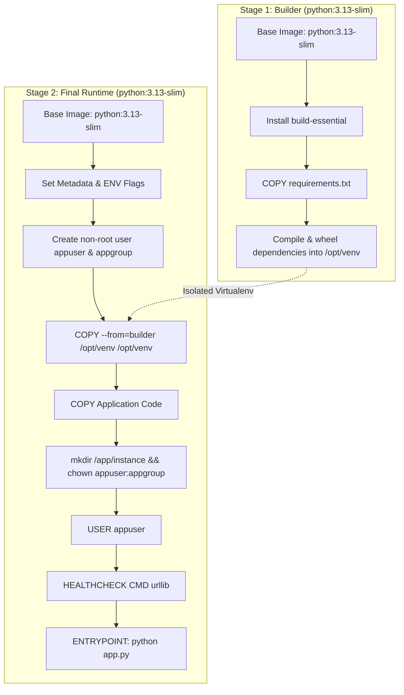

# 🐳 BrainCheck Docker Architecture & Containerization Guide

This document explains the containerization strategy, multi-stage compilation pipeline, security hardening, layer caching, persistent volumes, and operational orchestration used in **BrainCheck**.

---

## 📑 Table of Contents

- [Container Strategy & Goals](#container-strategy--goals)
- [Multi-Stage Dockerfile Anatomy](#multi-stage-dockerfile-anatomy)
- [Docker Layer Caching Optimization](#docker-layer-caching-optimization)
- [Security Hardening (Non-Root Execution)](#security-hardening-non-root-execution)
- [Persistent Storage & Volumes](#persistent-storage--volumes)
- [Container Healthcheck & Self-Healing](#container-healthcheck--self-healing)
- [Docker Compose Orchestration](#docker-compose-orchestration)
- [Docker Commands Cheat Sheet](#docker-commands-cheat-sheet)
- [Troubleshooting Container Issues](#troubleshooting-container-issues)

---

## Container Strategy & Goals

The containerization of BrainCheck was designed with four core architectural goals:

1. **Deterministic Reproducibility**: Eliminate the classic *"works on my machine"* dilemma by bundling Python 3.13 runtime, C compilation artifacts, and dependencies in an isolated container.
2. **Minimal Attack Surface**: Strip compilers, package caches, and root privileges from the final production runtime image.
3. **Optimized Build Speed**: Exploit Docker layer caching to ensure subsequent builds execute in milliseconds when only Python code is edited.
4. **Data Durability**: Decouple database lifecycle from container lifecycle using named Docker volumes.

---

## Multi-Stage Dockerfile Anatomy

The BrainCheck Dockerfile uses a 2-stage build:



### Stage 1: The Builder Stage
```dockerfile
FROM python:3.13-slim AS builder
WORKDIR /build

ENV PYTHONDONTWRITEBYTECODE=1 \
    PYTHONUNBUFFERED=1

RUN apt-get update && \
    apt-get install -y --no-install-recommends build-essential && \
    rm -rf /var/lib/apt/lists/*

COPY requirements.txt .
RUN python -m venv /opt/venv && \
    /opt/venv/bin/pip install --upgrade pip && \
    /opt/venv/bin/pip install --no-cache-dir -r requirements.txt
```
*Why this matters*: `build-essential` is needed if any Python package wheels require C compilation. However, leaving `build-essential` in a production image inflates image size by hundreds of megabytes and introduces unnecessary binaries. Stage 1 keeps all build tools confined.

### Stage 2: The Final Runtime Stage
```dockerfile
FROM python:3.13-slim AS final
WORKDIR /app

ENV PYTHONDONTWRITEBYTECODE=1 \
    PYTHONUNBUFFERED=1 \
    PATH="/opt/venv/bin:$PATH" \
    FLASK_APP="app.py" \
    FLASK_ENV="production" \
    PORT=5000

# Create dedicated non-privileged user and group
RUN groupadd --system appgroup && \
    useradd  --system --gid appgroup --create-home appuser

# Copy only the compiled virtualenv
COPY --from=builder /opt/venv /opt/venv
COPY . .

# Grant permissions to SQLite data directory
RUN mkdir -p instance && \
    chown -R appuser:appgroup instance

USER appuser
EXPOSE 5000

HEALTHCHECK --interval=30s --timeout=5s --start-period=10s --retries=3 \
    CMD python -c "import urllib.request; urllib.request.urlopen('http://localhost:5000/')" || exit 1

CMD ["python", "app.py"]
```

---

## Docker Layer Caching Optimization

Docker processes Dockerfile instructions top-to-bottom and caches layer outputs. If an instruction's inputs haven't changed, Docker reuses the existing cached layer.

- **Bad Pattern**:
  ```dockerfile
  COPY . .
  RUN pip install -r requirements.txt
  ```
  *Result*: Any single line change in `app.py` or a template invalidates the cache for `COPY . .`, forcing Docker to re-download and re-install all Python dependencies.

- **BrainCheck Pattern**:
  ```dockerfile
  COPY requirements.txt .
  RUN pip install -r requirements.txt
  COPY . .
  ```
  *Result*: Dependency installation is cached until `requirements.txt` is modified. Normal code edits rebuild in under 2 seconds.

---

## Security Hardening (Non-Root Execution)

By default, Docker containers run commands as `root` (UID 0). If a vulnerability exists in the web app, an attacker could potentially exploit root privileges to access container host subsystems.

### Mitigations applied in BrainCheck:
1. `groupadd --system appgroup && useradd --system --gid appgroup appuser`: Creates an isolated system user without interactive shell or sudo rights.
2. `chown -R appuser:appgroup instance`: Only the database directory is writable by the app user.
3. `USER appuser`: Drops all subsequent execution to non-root privileges before serving HTTP traffic.

---

## Persistent Storage & Volumes

SQLite saves database state in `/app/instance/database.db`. If a container is stopped or upgraded, any internal file without a volume mount is lost.

In `docker-compose.yml`:
```yaml
services:
  web:
    volumes:
      - braincheck_data:/app/instance

volumes:
  braincheck_data:
    driver: local
```

- When the container is destroyed via `docker compose down`, `braincheck_data` remains intact on the host storage engine.
- Subsequent `docker compose up` commands automatically re-mount the database volume, ensuring 100% data persistence across container rebuilds.

---

## Container Healthcheck & Self-Healing

The Dockerfile defines a native healthcheck:
```dockerfile
HEALTHCHECK --interval=30s --timeout=5s --start-period=10s --retries=3 \
    CMD python -c "import urllib.request; urllib.request.urlopen('http://localhost:5000/')" || exit 1
```

- Every **30 seconds**, Docker executes a Python HTTP request to `http://localhost:5000/`.
- If the endpoint returns a valid status code within 5 seconds, the container status is flagged as `healthy`.
- If 3 consecutive checks fail, the status switches to `unhealthy`, alerting orchestrators (Compose, Swarm, Kubernetes) to restart the container.

---

## Docker Compose Orchestration

The `docker-compose.yml` file configures the complete application lifecycle:

```yaml
services:
  web:
    build: .
    image: braincheck:latest
    container_name: braincheck_web
    ports:
      - "5000:5000"
    volumes:
      - braincheck_data:/app/instance
    environment:
      - FLASK_APP=app.py
      - FLASK_ENV=production
      - FLASK_DEBUG=False
      - SECRET_KEY=${SECRET_KEY:-braincheck-secret-key-change-me}
      - DATABASE_URL=sqlite:////app/instance/database.db
      - ADMIN_EMAIL=${ADMIN_EMAIL:-admin@braincheck.com}
      - ADMIN_PASSWORD=${ADMIN_PASSWORD:-Admin@123}
      - QUIZ_TIME_LIMIT=${QUIZ_TIME_LIMIT:-300}
    restart: unless-stopped
    healthcheck:
      test: ["CMD", "python", "-c", "import urllib.request; urllib.request.urlopen('http://localhost:5000/')"]
      interval: 30s
      timeout: 5s
      start_period: 15s
      retries: 3

volumes:
  braincheck_data:
    driver: local
```

---

## Docker Commands Cheat Sheet

| Task | Command |
|---|---|
| Build and start in background | `docker compose up -d --build` |
| View live container logs | `docker compose logs -f web` |
| Check container health status | `docker ps` |
| Stop containers | `docker compose stop` |
| Stop and remove containers | `docker compose down` |
| Reset database & delete volume | `docker compose down -v` |
| Execute interactive shell in container | `docker exec -it braincheck_web sh` |
| Inspect database file size inside container | `docker exec -it braincheck_web ls -lh /app/instance` |

---

## Troubleshooting Container Issues

### Issue 1: `bind: address already in use` (Port 5000 conflict)
**Solution**: Change the external port mapping in `docker-compose.yml`:
```yaml
ports:
  - "5050:5000"
```
Access at `http://localhost:5050`.

### Issue 2: Permission denied on `/app/instance/database.db`
**Solution**: Verify ownership in Dockerfile:
`RUN mkdir -p instance && chown -R appuser:appgroup instance`

### Issue 3: Container unhealthy status in `docker ps`
**Solution**: Inspect container logs using `docker compose logs web` to diagnose if a migration or database seeding issue occurred.
