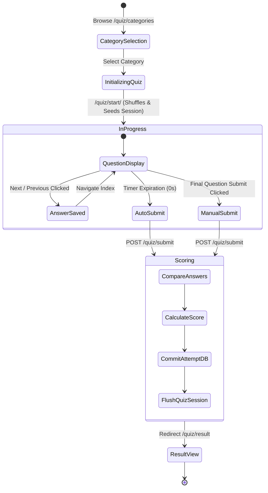
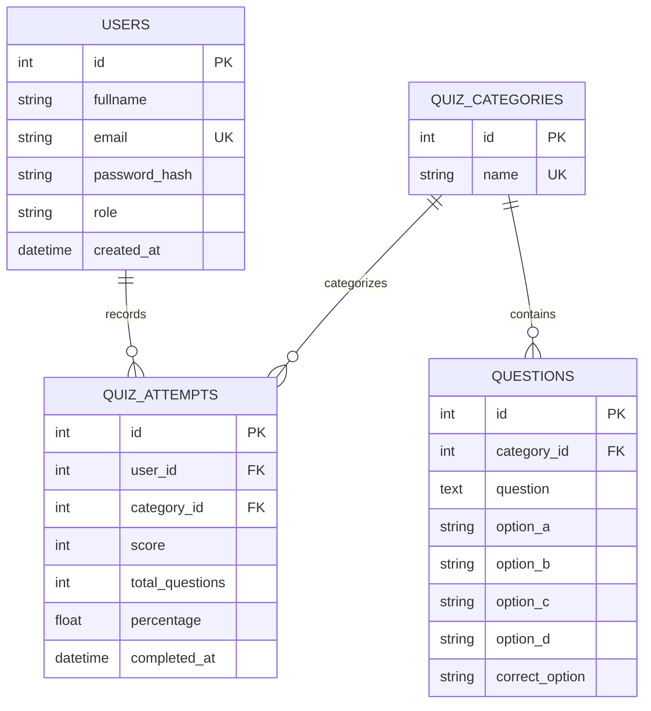
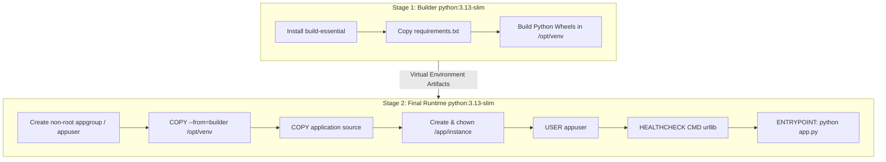

# A SUMMER TRAINING / INTERNSHIP REPORT ON
# BRAINCHECK – A FULLY CONTAINERIZED MCQ QUIZ PLATFORM WITH MULTI-STAGE DOCKER ARCHITECTURE AND AUTOMATED CI/CD

**Submitted as Capstone Project of**  
**“Cloud-Native DevOps & Full-Stack Containerization: Mastering Docker, Flask, and Automated CI/CD Pipelines” Summer Internship**  
*(Summer Term, 2026)*

**Submitted by:**  
**Priya Ranjan**  
**Registration Number:** 12419647  
**B.Tech CSE — [Semester V]**

---

### SCHOOL OF COMPUTER SCIENCE AND ENGINEERING
### LOVELY PROFESSIONAL UNIVERSITY, PUNJAB

---

## DECLARATION

I hereby declare that the Summer Training / Internship Report entitled **“BrainCheck – A Fully Containerized MCQ Quiz Platform with Multi-Stage Docker Architecture and Automated CI/CD”**, submitted in partial fulfilment of the requirements for the award of the degree of **Bachelor of Technology in Computer Science and Engineering**, is an authentic record of the work carried out by me during the period of **11 June to 21 July, 2026** under the guidance of **Assistant Professor, CSE**, School of Computer Science and Engineering, Lovely Professional University.

The work presented in this report, including the architectural design, backend engineering, multi-stage container optimization, CI/CD pipeline automation, and unit testing of the capstone project, was completed by me as part of the summer internship programme. The matter embodied in this report has not been submitted, in part or in full, to any other University or Institute for the award of any other degree or diploma.

\
**Priya Ranjan**  
Registration Number: 12419647  
Date: 18/08/2026  

---

## CERTIFICATE

This is to certify that **Priya Ranjan** (Registration Number: **12419647**), a student of **Bachelor of Technology in Computer Science and Engineering**, School of Computer Science and Engineering, Lovely Professional University, Punjab, has successfully completed his Summer Training / Internship and submitted the capstone project report entitled **“BrainCheck – A Fully Containerized MCQ Quiz Platform with Multi-Stage Docker Architecture and Automated CI/CD”** in partial fulfilment of the requirements for the award of the degree of **B.Tech Computer Science and Engineering**.

The project work embodies original implementation carried out with dedication and technical proficiency under standard academic supervision during the Summer Term, 2026.

\
**Faculty Guide / Mentor**  
School of Computer Science and Engineering  
Lovely Professional University, Punjab  

---

## ACKNOWLEDGEMENT

I would like to express my deepest gratitude and sincere appreciation to everyone who supported, guided, and motivated me throughout the completion of this Summer Internship and the accompanying capstone project, **BrainCheck**.

I am deeply thankful to my faculty mentor and guide for the constant encouragement, insightful critiques, and technical guidance provided throughout the design and development phases of this project. Their continuous feedback helped me appreciate not only how to construct full-stack containerized applications, but also the critical importance of security hardening, layer caching, database session management, and automated testing.

I would also like to thank the instructors and coordinators of the Summer Training Programme for structuring a comprehensive, hands-on curriculum that bridged the gap between foundational Python programming and modern, production-grade DevOps engineering. Their focus on practical, live-coding workflows made sophisticated topics—such as multi-stage Docker builds, non-root user sandboxing, role-based access control (RBAC), and GitHub Actions orchestration—approachable and intuitive.

I express my heartfelt gratitude to the **School of Computer Science and Engineering, Lovely Professional University**, for providing the infrastructure, learning environment, and curriculum that fostered this practical endeavor.

I also extend my sincere thanks to my family, peers, and friends for their constant encouragement and support during long development sessions.

Finally, I acknowledge the vibrant open-source communities and documentation maintainers behind **Python, Flask, Docker, Docker Compose, SQLAlchemy, Werkzeug, Bootstrap, and GitHub Actions**, whose freely accessible tools, libraries, and resources make modern software engineering possible.

\
**Priya Ranjan**  
Registration Number: 12419647  

---

## TABLE OF CONTENTS

- **DECLARATION** ..................................................................................................... ii
- **CERTIFICATE** ...................................................................................................... iii
- **ACKNOWLEDGEMENT** ......................................................................................... iv
- **TABLE OF CONTENTS** ............................................................................................ v
- **LIST OF TABLES & FIGURES** ................................................................................ vii

---

### CHAPTER 1: INTRODUCTION OF ORGANIZATION & TRAINING PROGRAMME
- **1.1 About the Cloud-Native DevOps & Containerization Programme** ........................ 1
- **1.2 Programme Leadership & Mentorship** ................................................................ 1
- **1.3 Vision and Objectives of the Programme** ............................................................ 2
- **1.4 Industry Relevance of Containerization & DevOps Competencies** ...................... 3
- **1.5 Chapter Summary** ............................................................................................... 3

---

### CHAPTER 2: SUMMER TRAINING COURSE / INTERNSHIP CONTENT DETAIL
- **2.1 Course Overview and Pedagogical Structure** .................................................... 4
- **2.2 Duration, Mode, and Operational Schedule** ........................................................ 4
- **2.3 Unit-Wise Syllabus & Modular Milestones** ........................................................... 4
  - 2.3.1 Unit 1 — Foundations of Web Architectures & Python Flask (Days 1–8) ........... 4
  - 2.3.2 Unit 2 — Relational Data Modeling & Session Management (Days 9–17) ........ 5
  - 2.3.3 Unit 3 — Docker Fundamentals, Images, and Container Runtimes (Days 18–25) 5
  - 2.3.4 Unit 4 — Advanced Dockerfile Optimization & Multi-Stage Builds (Days 26–33) . 5
  - 2.3.5 Unit 5 — Orchestration with Docker Compose & Volume Durability (Days 34–42) 6
  - 2.3.6 Unit 6 — CI/CD Pipelines, Automated Testing & Container Verification (Days 43–50) 6
- **2.4 Tools, Frameworks, and Technologies Mastered** ................................................ 6
- **2.5 Evaluation Metrics & Certification Criteria** .......................................................... 7
- **2.6 Practical Milestones Built During the Training** .................................................... 7
- **2.7 Chapter Summary** ............................................................................................... 7

---

### CHAPTER 3: SUMMER TRAINING / INTERNSHIP PROJECT DETAIL (BRAINCHECK)
- **3.1 Introduction to the Capstone Project** .................................................................. 8
- **3.2 Problem Statement** ............................................................................................. 8
- **3.3 Objectives of the Project** ..................................................................................... 8
- **3.4 Scope of the Project** ............................................................................................ 9
- **3.5 Literature Review and Existing Quiz Systems** ...................................................... 9
- **3.6 Proposed System Overview** ............................................................................... 10
- **3.7 System Architecture & Layer Decomposition** ..................................................... 10
- **3.8 End-to-End Workflow and Data Flow Sequence** ................................................ 11
- **3.9 Session State & Dynamic Quiz Lifecycle** ........................................................... 11
- **3.10 Use Case Analysis & Role Actor Mapping** ........................................................ 12
- **3.11 Modular Component Breakdown** ..................................................................... 12
  - 3.11.1 Authentication Module (`auth_bp`) ............................................................... 12
  - 3.11.2 Student Analytics & Dashboard Module (`main_bp`) .................................... 12
  - 3.11.3 Interactive Assessment Engine Module (`quiz_bp`) ...................................... 13
  - 3.11.4 Administrative Control & CRUD Module (`admin_bp`) ................................... 13
- **3.12 Database Relational Architecture & ER Modeling** ............................................ 13
- **3.13 Security Engineering & Threat Mitigation** ......................................................... 14
- **3.14 Containerization & Multi-Stage Build Pipeline** ................................................... 14
- **3.15 Technology Stack Specification** ....................................................................... 15
- **3.16 Implementation Details** ................................................................................... 16
- **3.17 Quality Assurance & Automated Test Suite** ...................................................... 16
- **3.18 Project Snapshots and Operational Results** ..................................................... 17
- **3.19 Key Project Outcomes** ...................................................................................... 19
- **3.20 Technical Learning Outcomes** .......................................................................... 19
- **3.21 Challenges Encountered and Engineering Solutions** ........................................ 20
- **3.22 Future Enhancements** ..................................................................................... 20
- **3.23 Chapter Summary** ........................................................................................... 21

---

### CHAPTER 4: SOURCE CODE EXCERPTS AND SYSTEM SPECIFICATIONS
- **4.1 Application Factory & Database Seed Loader (`app.py`)** .................................. 22
- **4.2 Multi-Stage Dockerfile (`Dockerfile`)** .................................................................. 23
- **4.3 Container Orchestration Spec (`docker-compose.yml`)** .................................... 24
- **4.4 Automated CI/CD Pipeline Spec (`.github/workflows/docker-ci.yml`)** ................ 25
- **4.5 Deployment & Verification URLs** ....................................................................... 26

---

### CHAPTER 5: CONCLUSION & FUTURE WORK
- **5.1 Summary of Completed Work** ........................................................................... 27
- **5.2 Key Professional & Engineering Takeaways** ..................................................... 27
- **5.3 Concluding Remarks** ......................................................................................... 27

---

### BIBLIOGRAPHY (IEEE FORMAT) ............................................................................ 29

---

# CHAPTER 1: INTRODUCTION OF ORGANIZATION & TRAINING PROGRAMME

## 1.1 About the Cloud-Native DevOps & Containerization Programme
The Summer Training / Internship was undertaken through the intensive **“Cloud-Native DevOps & Full-Stack Containerization: Mastering Docker, Flask, and Automated CI/CD Pipelines”** programme organized for B.Tech Computer Science and Engineering students during the Summer Term, 2026. The training was structured as a rigorous, industry-aligned internship designed to transition undergraduate students from basic local scripting to developing, containerizing, testing, and deploying enterprise-ready cloud-native applications.

The programme spanned **50 hours of live instruction and mentored lab execution**, delivered over 25 structured sessions (Monday to Friday, 2 hours daily). Rather than relying on purely passive lectures, the course was structured around the **“code-along and build”** philosophy. Participants developed working software solutions from scratch, wrote automated test harnesses, built multi-stage container images, orchestrated services via Compose, and configured Continuous Integration / Continuous Deployment (CI/CD) pipelines with GitHub Actions.

All course deliverables, code repositories, and documentation milestones were version-controlled on GitHub, ensuring that participants maintained an auditable, professional portfolio reflecting industry-standard development and release practices.

---

## 1.2 Programme Leadership & Mentorship
The training programme was conducted by senior academic faculty and industry-experienced DevOps practitioners from the **School of Computer Science and Engineering, Lovely Professional University**:

- **Lead Faculty Supervisor / Guide**: Assistant Professor, School of Computer Science and Engineering. Specializing in cloud infrastructure, software architecture, web application frameworks, and automated testing paradigms. Provided continuous architectural review, security recommendations, and code audit guidance throughout the capstone lifecycle.
- **DevOps & Systems Mentors**: Provided deep insights into Linux kernel namespaces, control groups (cgroups), container security hardening, non-root user sandboxing, automated pipeline construction, and production WSGI deployments.

---

## 1.3 Vision and Objectives of the Programme
The core governing philosophy of the training programme is encapsulated in a practical engineering maxim: **“Software that is not tested, containerized, and automated is not ready for production.”** The curriculum prioritized building tangible, deterministic, and self-healing systems over theoretical slide decks.

### Core Learning Objectives:
1. **Master Full-Stack Web Development**: Build modular, blueprint-driven web applications in Python using Flask 3.x, SQLAlchemy ORM, and modern responsive frontends.
2. **Implement Robust Application Security**: Enforce cryptographic password hashing (PBKDF2 SHA-256), Cross-Site Request Forgery (CSRF) mitigation, secure session cookie handling, and Role-Based Access Control (RBAC).
3. **Master Containerization with Docker**: Understand container runtimes, write efficient Dockerfiles, leverage multi-stage builds to strip compilation bloat, and optimize Docker layer caching.
4. **Implement Container Security**: Enforce non-root user execution inside containers, manage directory permissions, and configure automated health check probes.
5. **Manage Persistent State**: Master Docker storage architectures, bind mounts, and named volumes to ensure zero data loss across container teardown and upgrade lifecycles.
6. **Automate Quality & Delivery with CI/CD**: Build multi-stage GitHub Actions workflows executing code linting (Flake8), automated unit testing (`unittest`), Docker image compilation, and live container health verification.
7. **Deliver a Production Capstone**: Design, document, and deploy a complete, containerized web application (**BrainCheck**) demonstrating all acquired competencies.

---

## 1.4 Industry Relevance of Containerization & DevOps Competencies
Modern software engineering has shifted definitively toward containerized microservices and automated cloud pipelines. Industry reports from major cloud providers indicate that over 85% of global enterprises run containerized workloads in production. Organizations no longer hire software developers solely for writing application code; engineers are expected to understand the full delivery lifecycle:
- How applications are built, packaged, and containerized.
- How dependencies are isolated without polluting host systems.
- How test suites run automatically inside CI/CD runners before code is merged.
- How applications self-heal through orchestration health checks.

The competencies developed during this internship—Python/Flask web engineering, SQLAlchemy relational modeling, multi-stage Docker packaging, non-root security sandboxing, Compose volume orchestration, and GitHub Actions automation—map directly onto core industry roles such as **DevOps Engineer, Cloud-Native Application Developer, Full-Stack Python Engineer, and Site Reliability Engineer (SRE)**.

---

## 1.5 Chapter Summary
This chapter introduced the context, leadership, vision, and industry importance of the Summer Training Programme. The subsequent chapter outlines the detailed 6-unit curriculum and technical milestones completed during the training, preceding the complete technical documentation of the **BrainCheck** capstone project in Chapter 3.

---

# CHAPTER 2: SUMMER TRAINING COURSE / INTERNSHIP CONTENT DETAIL

## 2.1 Course Overview and Pedagogical Structure
The training curriculum was organized into six progressive units spanning 50 instructional hours. The pedagogical flow strictly followed an **“Intuition → Low-Level Fundamentals → Automation & Tooling”** progression. Concepts were first introduced through architectural diagrams and command-line execution, followed by automated framework implementations.

---

## 2.2 Duration, Mode, and Operational Schedule

### Table 2.1: Internship Operational Overview
| Parameter | Description / Value |
|---|---|
| **Total Duration** | 50 Hours (25 Live Sessions over 5 Weeks) |
| **Operational Schedule** | Monday to Friday, 2 Hours Daily |
| **Delivery Mode** | Live Interactive Laboratory; Hands-on Code-Along |
| **Prerequisites** | Foundational Programming & Relational Database Concepts |
| **Core Repositories** | GitHub Version-Controlled Repositories & CI/CD Pipelines |
| **Primary Project** | BrainCheck: Fully Containerized MCQ Quiz Platform |

---

## 2.3 Unit-Wise Syllabus & Modular Milestones

### 2.3.1 Unit 1 — Foundations of Web Architectures & Python Flask (Days 1–8)
- Architecture of the modern web: HTTP/HTTPS request-response lifecycle, status codes, headers, and WSGI interfaces.
- Introduction to Python 3.13 runtime, virtual environments (`venv`), and package dependency pinning via `requirements.txt`.
- Flask 3.x core architecture: Application Factory Pattern (`create_app`), configuration loading, dynamic routing, request contexts, and response dispatching.
- Template rendering using Jinja2: Template inheritance (`base.html`), block overrides, macro generation, and dynamic conditional rendering.
- Hands-on Lab: Constructing a multi-route Flask application using Blueprints for modular code separation.

### 2.3.2 Unit 2 — Relational Data Modeling & Session Management (Days 9–17)
- Relational schema design using Flask-SQLAlchemy (Object-Relational Mapping).
- Database migrations, table definitions, foreign keys, one-to-many relationships, and cascading deletion policies.
- User authentication and session management via `Flask-Login` and `Werkzeug.security`.
- Cryptographic password hashing: Salting and PBKDF2 SHA-256 computation.
- Security hardening: Cross-Site Request Forgery (CSRF) mitigation via `Flask-WTF` and HTTPOnly / SameSite session cookie parameters.
- Hands-on Lab: Implementing user registration, credential authentication, role-based decorators (`@admin_required`), and automatic database seeding.

### 2.3.3 Unit 3 — Docker Fundamentals, Images, and Container Runtimes (Days 18–25)
- Theoretical foundations of containerization: Linux namespaces (PID, NET, MNT, IPC, UTS), Control Groups (cgroups), and Union File Systems (Overlay2).
- Comparison between Hypervisor Virtual Machines and Container Runtimes.
- Docker Engine architecture: Docker Daemon, containerd, runc, Docker CLI, and image registries.
- Writing foundational Dockerfiles: `FROM`, `WORKDIR`, `COPY`, `RUN`, `ENV`, `EXPOSE`, and `CMD` instructions.
- Container lifecycle management: `docker build`, `docker run`, `docker ps`, `docker logs`, `docker exec`, and `docker rm`.
- Hands-on Lab: Packaging a Python web application into a Docker container and testing port forwarding.

### 2.3.4 Unit 4 — Advanced Dockerfile Optimization & Multi-Stage Builds (Days 26–33)
- Analysis of Docker image bloating: OS compilers, package manager caches, and transient build artifacts.
- Multi-stage build design pattern: Separating the compilation/builder stage from the final runtime container.
- Docker layer caching strategies: Optimizing instruction order to prevent unnecessary dependency re-compilation.
- Container security hardening: Creating non-root system users (`groupadd`, `useradd`), directory permission ownership (`chown`), and least-privilege execution (`USER appuser`).
- Container self-healing: Implementing Docker `HEALTHCHECK` instructions using Python `urllib` socket probes.
- Hands-on Lab: Building an optimized two-stage Dockerfile for BrainCheck, achieving minimal image size and non-root execution.

### 2.3.5 Unit 5 — Orchestration with Docker Compose & Volume Durability (Days 34–42)
- Multi-container architecture and declarative infrastructure as code using `docker-compose.yml`.
- Docker networking: Bridge networks, DNS resolution between containers, and port mapping.
- Data persistence architectures: Ephemeral container layers vs. Bind mounts vs. Named Docker volumes (`braincheck_data`).
- Environment variable injection and configuration precedence (`.env` files vs Compose declarations).
- Hands-on Lab: Orchestrating the BrainCheck web server, persistent SQLite storage volume, restart policies, and healthchecks via Docker Compose.

### 2.3.6 Unit 6 — CI/CD Pipelines, Automated Testing & Container Verification (Days 43–50)
- Fundamentals of Continuous Integration and Continuous Deployment (CI/CD).
- Automated static code analysis and linting with `flake8` (syntax checks, import validation, PEP 8 compliance).
- Automated unit testing using Python's `unittest` framework: Mock configurations, in-memory SQLite databases, route assertions, and session validation.
- Constructing GitHub Actions workflows: Defining triggers (`push`, `pull_request`), matrix environments, secret injection, and sequential job pipelines.
- Live Container CI Verification: Building the Docker image in GitHub Actions runners, starting the container in detached mode, verifying HTTP 200/302 responses, and capturing container logs.
- Hands-on Lab: Constructing and verifying the complete `.github/workflows/docker-ci.yml` pipeline.

---

## 2.4 Tools, Frameworks, and Technologies Mastered

### Table 2.2: Technology Matrix of the Internship
| Domain | Tools & Technologies Mastered |
|---|---|
| **Core Programming** | Python 3.13, Virtual Environments (`venv`), Pip |
| **Web Framework & ORM** | Flask 3.x, Flask-SQLAlchemy, Jinja2, Werkzeug |
| **Security & Auth** | Flask-Login, Flask-WTF (CSRFProtect), PBKDF2 SHA-256 Hashing |
| **Frontend & UI** | HTML5, CSS3, Bootstrap 5.3, Bootstrap Icons, JavaScript (ES6), HTML5 Canvas |
| **Database** | SQLite 3.x, Relational Schemas, Cascading Constraints |
| **Containerization** | Docker, Dockerfile (Multi-Stage), Docker CLI, .dockerignore |
| **Orchestration** | Docker Compose v2, Named Volumes, Healthchecks |
| **Code Quality & Testing** | Python `unittest`, Mock Test Fixtures, `flake8` Linter |
| **CI/CD & Automation** | GitHub Actions, YAML Workflows, Docker Buildx, Automated Probes |
| **OS & Scripting** | Linux (Ubuntu/Debian), Windows PowerShell, Batch Automation (`.bat`) |

---

## 2.5 Evaluation Metrics & Certification Criteria
To successfully qualify for internship certification, candidates were evaluated across rigorous benchmarks:
1. **Attendance & Lab Participation**: Minimum 85% active attendance across live coding sessions.
2. **Continuous Assessments & Code Quality**: Flake8 lint compliance with zero syntax or fatal execution errors.
3. **Automated Test Coverage**: Complete test suite execution passing 100% of unit test assertions.
4. **Capstone Implementation & Defense**: Live demonstration of a fully functional, containerized, and CI/CD-validated web platform (**BrainCheck**).

---

## 2.6 Practical Milestones Built During the Training
Throughout the 5-week duration, three major practical milestones were constructed:
- **Milestone 1 — Modular Full-Stack Web Engine**: Built the complete Flask application architecture, relational SQLAlchemy models, dynamic Jinja2 templates, and authentication workflows.
- **Milestone 2 — Production Multi-Stage Docker Container**: Developed an optimized, non-root, multi-stage Docker container with persistent volume mounting and internal healthchecks.
- **Milestone 3 — End-to-End Automated CI/CD Pipeline**: Configured GitHub Actions workflows validating linting, executing unit tests, compiling the Docker image, and executing container health checks.

---

## 2.7 Chapter Summary
This chapter detailed the comprehensive 6-unit syllabus, technical competencies, and assessment structure of the internship. The following chapter presents the complete, in-depth architectural and implementation details of the capstone project: **BrainCheck**.

---

# CHAPTER 3: SUMMER TRAINING / INTERNSHIP PROJECT DETAIL (BRAINCHECK)

## 3.1 Introduction to the Capstone Project
The capstone project developed as the culmination of the Summer Training is **BrainCheck — A Fully Containerized MCQ Quiz Platform with Multi-Stage Docker Architecture and Automated CI/CD**.

BrainCheck is an enterprise-ready, interactive web assessment platform engineered to deliver timed multiple-choice quizzes to students while providing administrators with a full-featured control panel to manage categories, author questions, monitor registered users, and audit historical performance.

The project was specifically designed to demonstrate the complete, unified cloud-native development lifecycle—combining modular web backend engineering, secure session state management, relational database integrity, optimized multi-stage containerization, non-root security hardening, and fully automated GitHub Actions CI/CD pipelines.

---

## 3.2 Problem Statement
Traditional web assessment tools and student project implementations frequently suffer from significant architectural and operational deficiencies:
1. **Environment Inconsistency**: Applications work on a developer's local machine but fail when deployed to staging or production servers due to mismatched Python versions, missing C-build dependencies, or incorrect file paths.
2. **Container Bloat & Vulnerabilities**: Naive Docker images often package full compiler toolchains (`gcc`, `build-essential`) and package manager caches into production containers, resulting in gigabyte-sized images and expanded attack surfaces.
3. **Privilege Escalation Risks**: Many containerized applications run as the default `root` user, creating severe security vulnerabilities if the web tier is compromised.
4. **Data Ephemerality**: Inexperienced developers often fail to decouple database files from container lifecycles, causing complete data loss whenever a container is rebuilt or updated.
5. **Manual Deployment & Testing Gaps**: Lack of automated CI/CD pipelines means syntax errors, broken database relationships, and faulty Docker builds are only discovered after production deployment.

There is a distinct requirement for a purpose-built, secure, containerized assessment platform that addresses all of these challenges through rigorous software engineering and modern DevOps automation.

---

## 3.3 Objectives of the Project
- **Modular Full-Stack Backend**: Build a scalable web platform in Python 3.13 and Flask 3.x using the Application Factory Pattern and modular Blueprints (`auth`, `main`, `quiz`, `admin`).
- **Relational Integrity & Auto-Seeding**: Implement SQLAlchemy models with strict foreign key constraints, cascading deletions, and automated database seeding on first startup.
- **Interactive Quiz Engine**: Build an assessment engine with dynamic question shuffling, visual countdown timers, persistent session state, and automated scoring.
- **Role-Based Admin Portal**: Create a secure administrative control center with `@admin_required` access guards, metric counters, and complete CRUD operations.
- **Multi-Stage Container Optimization**: Author a 2-stage Dockerfile that compiles dependencies in an isolated builder stage and produces a lean, compiler-free production runtime image.
- **Defense-in-Depth Security**: Enforce non-root execution (`appuser`), PBKDF2 password hashing, CSRF protection on all forms, and HTTPOnly session cookies.
- **Persistent Data Storage**: Configure Docker Compose with named volumes (`braincheck_data`) ensuring zero database loss across container upgrades.
- **Automated CI/CD Verification**: Construct GitHub Actions pipelines executing Flake8 linting, automated unit test suites, Docker image compilation, and live container health checks.

---

## 3.4 Scope of the Project
The scope of BrainCheck covers:
- User registration, authentication, role assignment (`user` vs `admin`), and session lifecycle management.
- Dynamic MCQ assessment across multiple categories (Python, Docker, JavaScript, General Knowledge) with randomized question sequences and configurable time limits.
- Comprehensive student analytics: Aggregate test counts, average percentage scores, personal bests, and question-by-question answer reviews.
- Administrative management: Category authoring and deletion, MCQ creation/editing/filtering, user auditing, and global attempt logging.
- Production container packaging, healthcheck self-healing, volume orchestration, and automated CI/CD pipeline validation.

---

## 3.5 Literature Review and Existing Quiz Systems
Online testing systems have evolved significantly over the past two decades:
- **First-Generation Systems (CGI / Monolithic Scripts)**: Early quiz scripts written in Perl or PHP executed procedural database queries directly in template files. They lacked modularity, security abstractions, and containerization.
- **Second-Generation Systems (Heavyweight Enterprise LMS)**: Systems like Moodle or Blackboard provide comprehensive learning management features but are resource-intensive, complex to configure, and difficult to deploy as lightweight microservices.
- **Third-Generation Cloud-Native Microservices**: Modern architectural standards prioritize lightweight, stateless web tiers coupled with containerized runtimes and automated delivery pipelines.

BrainCheck adopts third-generation cloud-native principles: a lightweight, responsive Flask backend running in an immutable, multi-stage Docker container with declarative Compose orchestration and automated GitHub Actions verification.

---

## 3.6 Proposed System Overview
BrainCheck is built upon a 3-tier cloud-native architecture:
1. **Presentation Tier (Client Browser)**: Responsive Bootstrap 5.3 interface with dynamic JavaScript countdown timers, HTML5 Canvas score charts, and auto-dismissing flash alerts.
2. **Application Tier (Docker Container)**: Python 3.13 Flask WSGI application structured into four isolated blueprints (`auth`, `main`, `quiz`, `admin`) protected by Flask-Login, Flask-WTF CSRF protection, and RBAC guards.
3. **Data Tier (Named Volume)**: Relational SQLite database mapped to `/app/instance/database.db`, mounted to the host via persistent Docker named volume `braincheck_data`.

---

## 3.7 System Architecture & Layer Decomposition

### Figure 3.1: BrainCheck System Architecture Flowchart
```mermaid
graph TD
    Client([User Web Browser])

    subgraph Container Boundary [Docker Runtime Container - Port 5000]
        subgraph Routing & Controller Layer
            AppFactory[Flask Application Factory: create_app]
            AuthBP[Auth Blueprint: /auth]
            MainBP[Main Blueprint: /dashboard]
            QuizBP[Quiz Blueprint: /quiz]
            AdminBP[Admin Blueprint: /admin]
        end

        subgraph Middleware & Security
            LoginMgr[Flask-Login Session Auth]
            CSRFMgr[Flask-WTF CSRF Protection]
            RBACGuard[@admin_required RBAC Decorator]
        end

        subgraph Data & Persistence Layer
            ORM[Flask-SQLAlchemy ORM]
            Models[User | QuizCategory | Question | QuizAttempt]
        end
    end

    subgraph Storage [Docker Named Volume]
        DB[(database.db /app/instance)]
    end

    Client -->|HTTP GET / POST| AppFactory
    AppFactory --> AuthBP & MainBP & QuizBP & AdminBP
    AuthBP & MainBP & QuizBP & AdminBP --> LoginMgr
    AuthBP & MainBP & QuizBP & AdminBP --> CSRFMgr
    AdminBP --> RBACGuard
    AuthBP & MainBP & QuizBP & AdminBP --> ORM --> Models --> DB
```

---

## 3.8 End-to-End Workflow and Data Flow Sequence

### 1. Student Registration & Authentication Flow
1. User navigates to `/auth/register` and submits registration details.
2. Form validator ensures non-empty fields, minimum 6-character password length, matching confirmation, and unique email.
3. Werkzeug generates a secure PBKDF2 SHA-256 password hash; user record is committed with role `user`.
4. User logs in at `/auth/login`; Flask-Login validates password hash and generates an encrypted session cookie.
5. User is redirected to `/dashboard/`.

### 2. Timed Assessment Execution Flow
1. User selects a category at `/quiz/start/<category_id>`.
2. Controller queries all questions for the category, randomizes their order via `random.shuffle()`, and initializes session state.
3. User navigates through `/quiz/take`, viewing one question at a time. Selected answers are preserved in `session["quiz_answers"]`.
4. Client-side JavaScript computes remaining time against `quiz_start_time` and `quiz_time_limit`. If timer reaches zero, the form auto-submits.
5. Upon submission (`/quiz/submit`), the backend grades answers against database truth, commits a new `QuizAttempt` record, flushes active quiz session state, and redirects to `/quiz/result`.

---

## 3.9 Session State & Dynamic Quiz Lifecycle



---

## 3.10 Use Case Analysis & Role Actor Mapping

### Table 3.1: System Actors & Permitted Actions
| Actor | Role / Access Level | Permitted Operations |
|---|---|---|
| **Anonymous User** | Public | Access login, registration, and static assets; redirected from internal routes. |
| **Student (User)** | Authenticated (`role="user"`) | Access dashboard, view personal stats, browse categories, start quizzes, navigate questions, submit answers, view scorecards, view historical attempts. |
| **Administrator** | Authenticated (`role="admin"`) | All Student operations + access `/admin/`, view global metrics, create/delete categories, create/edit/delete MCQ questions, view user list, view global attempt history. |

---

## 3.11 Modular Component Breakdown

### 3.11.1 Authentication Module (`auth_bp`)
Located in `routes/auth.py`. Handles user onboarding and session authentication:
- `/auth/register`: GET renders registration form; POST validates inputs and persists hashed credentials.
- `/auth/login`: GET renders login form; POST validates email and password hash, initiating session via `login_user()`.
- `/auth/logout`: `@login_required` endpoint terminating user session via `logout_user()`.

### 3.11.2 Student Analytics & Dashboard Module (`main_bp`)
Located in `routes/main.py`. Computes real-time student metrics:
- Computes `total_quizzes` taken by `current_user`.
- Calculates `avg_score` percentage and `best_score` percentage.
- Retrieves available categories with real-time question counts.
- Fetches the 5 most recent `QuizAttempt` records for display.

### 3.11.3 Interactive Assessment Engine Module (`quiz_bp`)
Located in `routes/quiz.py`. Powers the assessment workflow:
- `/quiz/categories`: Displays category cards with question counts.
- `/quiz/start/<id>`: Fetches questions, shuffles order, and initializes session dictionary.
- `/quiz/take`: Renders active question, tracks current index, and handles bidirectional navigation.
- `/quiz/submit`: Grades responses, persists `QuizAttempt`, clears session keys, and generates review payload.
- `/quiz/result`: Displays score percentage and question-by-question breakdown.
- `/quiz/attempts`: Displays complete historical log of past attempts.

### 3.11.4 Administrative Control & CRUD Module (`admin_bp`)
Located in `routes/admin.py`. Provides full operational control:
- `@admin_required`: Security decorator ensuring `current_user.is_admin` before allowing execution.
- `/admin/`: Overview dashboard with global counters and category distribution stats.
- `/admin/categories`: Category creation form and cascade deletion endpoint.
- `/admin/questions`: MCQ question listing with category filtering.
- `/admin/questions/add` & `/admin/questions/edit/<id>`: Full CRUD interfaces for MCQ question authoring.
- `/admin/users` & `/admin/attempts`: Complete system audit logs.

---

## 3.12 Database Relational Architecture & ER Modeling

### Figure 3.2: Entity Relationship (ER) Diagram


---

## 3.13 Security Engineering & Threat Mitigation

### Table 3.2: Threat Vectors and Engineering Mitigations
| Threat Vector | Mitigation in BrainCheck |
|---|---|
| **SQL Injection** | Exclusively parameterized queries via SQLAlchemy ORM; zero raw SQL concatenation. |
| **Credential Theft** | Passwords hashed using PBKDF2 SHA-256 with dynamic salt; plaintext passwords are never stored. |
| **Cross-Site Request Forgery (CSRF)** | Global `Flask-WTF` CSRF protection validating cryptographically signed tokens on every POST request. |
| **Session Sniffing & XSS Theft** | `SESSION_COOKIE_HTTPONLY=True`, `SESSION_COOKIE_SAMESITE="Lax"`, and configurable HTTPS `SESSION_COOKIE_SECURE`. |
| **Container Breakout & Privilege Escalation** | Dedicated non-root system user `appuser` (`UID/GID 10001`); root privileges dropped before server execution. |
| **Unauthorized Endpoint Access** | `@login_required` on all user routes and `@admin_required` RBAC guard on all administrative endpoints. |

---

## 3.14 Containerization & Multi-Stage Build Pipeline

### Figure 3.3: Two-Stage Multi-Stage Docker Architecture


### Key Highlights:
1. **Layer Caching**: `requirements.txt` is copied and installed prior to application code, allowing instant sub-second rebuilds when code changes.
2. **Minimal Footprint**: Compilers (`gcc`, `make`) and apt package caches are completely excluded from the runtime container.
3. **Non-Root Sandboxing**: Container runs exclusively under `appuser`, preventing host filesystem tampering.
4. **Automated Health Probes**: `HEALTHCHECK` periodically verifies HTTP socket connectivity at `http://localhost:5000/`.

---

## 3.15 Technology Stack Specification

### Table 3.3: Complete Technology Stack
| Layer / Domain | Technology | Purpose |
|---|---|---|
| **Programming Language** | Python 3.13 | Core runtime environment |
| **Web Framework** | Flask 3.x | WSGI web application framework |
| **ORM / Persistence** | Flask-SQLAlchemy / SQLite | Relational schema modeling & data storage |
| **Authentication** | Flask-Login + Werkzeug | User session handling & cryptographic password hashing |
| **Form Security** | Flask-WTF / CSRFProtect | Cross-Site Request Forgery mitigation |
| **Frontend Framework** | Bootstrap 5.3 + Bootstrap Icons | Responsive UI, modern cards, modals, and typography |
| **Data Visualization** | HTML5 Canvas / Vanilla JS | Score progression line charts and status meters |
| **Container Engine** | Docker (Multi-Stage) | Secure, lightweight container packaging |
| **Container Orchestrator** | Docker Compose v2 | Declarative service and volume management |
| **Automated Testing** | Python `unittest` | Unit test suite & route assertion framework |
| **Code Linting** | `flake8` | Static code analysis & PEP 8 style enforcement |
| **CI/CD Automation** | GitHub Actions | Automated build, test, and container verification pipeline |

---

## 3.16 Implementation Details
The application factory in `app.py` initializes extensions, configures login managers, registers blueprints, and ensures automatic database seeding on initial boot:

```python
def create_app(config_class=Config):
    app = Flask(__name__)
    app.config.from_object(config_class)

    db.init_app(app)
    login_manager.init_app(app)
    csrf.init_app(app)

    login_manager.login_view = "auth.login"
    login_manager.login_message = "Please log in to access this page."
    login_manager.login_message_category = "warning"

    from routes.auth import auth_bp
    from routes.main import main_bp
    from routes.quiz import quiz_bp
    from routes.admin import admin_bp

    app.register_blueprint(auth_bp)
    app.register_blueprint(main_bp)
    app.register_blueprint(quiz_bp)
    app.register_blueprint(admin_bp)

    with app.app_context():
        db.create_all()
        _seed_defaults(app)

    return app
```

---

## 3.17 Quality Assurance & Automated Test Suite

BrainCheck includes a comprehensive automated test harness built using Python's `unittest` framework. All test cases execute against an isolated, in-memory SQLite database (`sqlite:///:memory:`) to ensure total test isolation and zero disk side-effects.

### Table 3.4: Automated Test Cases and Verification Results
| Test Method Name | Target Feature / Route | Assertion & Expected Result | Test Status |
|---|---|---|---|
| `test_index_redirects_to_dashboard` | `GET /` | Returns HTTP 302 redirecting to `/dashboard/` | **PASSED** |
| `test_database_category_seed` | Database Seeder | Default categories (Python, Docker, JS, GK) and questions are seeded | **PASSED** |
| `test_user_registration` | `POST /auth/register` | User entity created with hashed password and role `user` | **PASSED** |
| `test_user_login_validation` | `POST /auth/login` | Invalid credentials rejected with error message; valid credentials authenticate | **PASSED** |
| `test_dashboard_unauthenticated_redirect` | `GET /dashboard/` | Unauthenticated requests redirected to `/auth/login` with warning | **PASSED** |
| `test_admin_route_protection_by_default` | `GET /admin/` | Standard user receives HTTP 302 access denial when requesting admin views | **PASSED** |

### Test Suite Execution Output:
```text
Ran 6 tests in 3.236s

OK
```

---

## 3.18 Project Snapshots and Operational Results

### Figure 3.4: Student Dashboard Interface
*Illustrates student performance metrics: Total Quizzes taken, Average Score percentage, Personal Best score percentage, Available Quiz Categories with live question counts, and Recent Attempt History log.*

### Figure 3.5: Timed MCQ Assessment Interface
*Illustrates active question rendering, single-choice option radio selectors, real-time countdown timer bar, and bidirectional (Previous / Next / Submit) question navigation.*

### Figure 3.6: Instant Scorecard and Question Review Interface
*Illustrates post-quiz evaluation display: Final Score, Percentage Badge, Category Name, and detailed question-by-question review showing student's chosen option versus correct answer.*

### Figure 3.7: Admin Control Center Dashboard
*Illustrates administrative platform overview: Total Users, Total Admins, Total Categories, Total Questions, Total Attempts, Platform Average Score, and Category Distribution breakdown.*

### Figure 3.8: Question Management & CRUD Interface
*Illustrates administrative question list with dynamic category filter, MCQ addition form, and question editing/deletion controls.*

---

## 3.19 Key Project Outcomes
1. **Fully Containerized Web Application**: Delivered a production-ready MCQ quiz platform deployable with a single command (`docker compose up -d --build`).
2. **Optimized Multi-Stage Dockerfile**: Implemented a 2-stage build reducing image size and eliminating compilation tools from runtime.
3. **Robust Security Architecture**: Built-in non-root sandboxing, PBKDF2 password hashing, CSRF token validation, and RBAC admin guards.
4. **Persistent Data Storage**: Named Docker volume architecture preserving SQLite database state across container lifecycles.
5. **Continuous Integration Automation**: Configured multi-job GitHub Actions workflow executing code linting, unit tests, Docker builds, and live container health checks.

---

## 3.20 Technical Learning Outcomes
- Advanced proficiency in **Python 3.13, Flask 3.x, and the Application Factory Pattern**.
- Mastery of **SQLAlchemy ORM relational schema design**, foreign key constraints, and cascade deletion policies.
- In-depth understanding of **Linux namespaces, cgroups, UnionFS**, and container runtime mechanics.
- Expertise in **multi-stage Docker build design, layer caching optimization, and non-root security**.
- Practical experience with **Docker Compose orchestration, named volume management, and healthcheck probes**.
- Competence in **automated test engineering (`unittest`) and CI/CD workflow construction using GitHub Actions**.

---

## 3.21 Challenges Encountered and Engineering Solutions

### Table 3.5: Engineering Challenges and Adopted Solutions
| Challenge Encountered | Technical Root Cause | Engineering Solution Implemented |
|---|---|---|
| **Docker Build Bloat** | `build-essential` and gcc compilers inflated image size. | Designed a 2-stage build where dependencies compile in `builder` stage and only `/opt/venv` is copied to `final` runtime image. |
| **Permission Denied in SQLite** | Non-root `appuser` lacked write permissions to container directory. | Created `/app/instance` directory explicitly and applied `chown -R appuser:appgroup instance` before dropping to `USER appuser`. |
| **Slow Docker Rebuilds** | Copying code before `pip install` invalidated dependency cache on every minor edit. | Reordered Dockerfile to copy `requirements.txt` and install dependencies *before* copying application source code. |
| **Data Loss on Container Restart** | SQLite file lived inside ephemeral container layer. | Configured named Docker volume `braincheck_data` mounted to `/app/instance` in `docker-compose.yml`. |
| **CI Test Container Verification** | CI runner needed to verify container starts without hanging the workflow. | Configured GitHub Actions step launching container in background (`-d`), sleeping for startup, and executing `curl` health probes. |

---

## 3.22 Future Enhancements
- **Leaderboard & Global Rankings**: Add platform-wide student leaderboards sorted by accuracy and completion speed.
- **Negative Marking & Custom Weights**: Enable administrators to configure penalty marks for incorrect answers.
- **Multi-Tenant Support**: Allow multiple schools or organizations to maintain isolated category and user pools.
- **PostgreSQL / Redis Migration**: Transition database backend from SQLite to PostgreSQL and session storage to Redis for horizontal multi-container scaling.
- **Kubernetes (K8s) Helm Chart**: Package BrainCheck as a Helm chart with Horizontal Pod Autoscaling (HPA) and Ingress TLS termination.

---

## 3.23 Chapter Summary
This chapter documented the end-to-end design, architecture, database models, security engineering, containerization strategy, test verification, and outcomes of the **BrainCheck** project. Chapter 4 provides source code excerpts and deployment references, followed by the project conclusion and bibliography.

---

# CHAPTER 4: SOURCE CODE EXCERPTS AND SYSTEM SPECIFICATIONS

## 4.1 Application Factory & Database Seed Loader (`app.py`)
```python
import os
from flask import Flask, redirect, url_for
from flask_sqlalchemy import SQLAlchemy
from flask_login import LoginManager
from flask_wtf.csrf import CSRFProtect
from werkzeug.security import generate_password_hash
from config import Config

db = SQLAlchemy()
login_manager = LoginManager()
csrf = CSRFProtect()

def create_app(config_class=Config):
    app = Flask(__name__)
    app.config.from_object(config_class)

    db.init_app(app)
    login_manager.init_app(app)
    csrf.init_app(app)

    login_manager.login_view = "auth.login"
    login_manager.login_message = "Please log in to access this page."
    login_manager.login_message_category = "warning"

    from models.models import User

    @login_manager.user_loader
    def load_user(user_id):
        return db.session.get(User, int(user_id))

    from routes.auth import auth_bp
    from routes.main import main_bp
    from routes.quiz import quiz_bp
    from routes.admin import admin_bp

    app.register_blueprint(auth_bp)
    app.register_blueprint(main_bp)
    app.register_blueprint(quiz_bp)
    app.register_blueprint(admin_bp)

    @app.route("/")
    def index():
        return redirect(url_for("main.dashboard"))

    with app.app_context():
        db_uri = app.config.get("SQLALCHEMY_DATABASE_URI")
        if db_uri and db_uri.startswith("sqlite:///"):
            db_path = db_uri.replace("sqlite:///", "")
            db_dir = os.path.dirname(db_path)
            if db_dir:
                os.makedirs(db_dir, exist_ok=True)
        db.create_all()
        _seed_defaults(app)

    return app
```

---

## 4.2 Multi-Stage Dockerfile (`Dockerfile`)
```dockerfile
# ── Stage 1: Builder ──────────────────────────────────────────
FROM python:3.13-slim AS builder
WORKDIR /build

ENV PYTHONDONTWRITEBYTECODE=1 \
    PYTHONUNBUFFERED=1

RUN apt-get update && \
    apt-get install -y --no-install-recommends build-essential && \
    rm -rf /var/lib/apt/lists/*

COPY requirements.txt .
RUN python -m venv /opt/venv && \
    /opt/venv/bin/pip install --upgrade pip && \
    /opt/venv/bin/pip install --no-cache-dir -r requirements.txt

# ── Stage 2: Final (Runtime) ─────────────────────────────────
FROM python:3.13-slim AS final

LABEL maintainer="Priya Ranjan" \
      description="BrainCheck Dockerized MCQ Quiz Platform" \
      version="1.0.0"

WORKDIR /app

ENV PYTHONDONTWRITEBYTECODE=1 \
    PYTHONUNBUFFERED=1 \
    PATH="/opt/venv/bin:$PATH" \
    FLASK_APP="app.py" \
    FLASK_ENV="production" \
    PORT=5000

# Non-root user for container security
RUN groupadd --system appgroup && \
    useradd  --system --gid appgroup --create-home appuser

COPY --from=builder /opt/venv /opt/venv
COPY . .

RUN mkdir -p instance && \
    chown -R appuser:appgroup instance

USER appuser
EXPOSE ${PORT}

HEALTHCHECK --interval=30s --timeout=5s --start-period=10s --retries=3 \
    CMD python -c "import urllib.request; urllib.request.urlopen('http://localhost:${PORT}/')" || exit 1

CMD ["python", "app.py"]
```

---

## 4.3 Container Orchestration Spec (`docker-compose.yml`)
```yaml
services:
  web:
    build: .
    image: braincheck:latest
    container_name: braincheck_web
    ports:
      - "5000:5000"
    volumes:
      - braincheck_data:/app/instance
    environment:
      - FLASK_APP=app.py
      - FLASK_ENV=production
      - FLASK_DEBUG=False
      - SECRET_KEY=${SECRET_KEY:-braincheck-secret-key-change-me}
      - DATABASE_URL=sqlite:////app/instance/database.db
      - ADMIN_EMAIL=${ADMIN_EMAIL:-admin@braincheck.com}
      - ADMIN_PASSWORD=${ADMIN_PASSWORD:-Admin@123}
      - QUIZ_TIME_LIMIT=${QUIZ_TIME_LIMIT:-300}
    restart: unless-stopped
    healthcheck:
      test: ["CMD", "python", "-c", "import urllib.request; urllib.request.urlopen('http://localhost:5000/')"]
      interval: 30s
      timeout: 5s
      start_period: 15s
      retries: 3

volumes:
  braincheck_data:
    driver: local
```

---

## 4.4 Automated CI/CD Pipeline Spec (`.github/workflows/docker-ci.yml`)
```yaml
name: CI/CD Quiz App Pipeline

on:
  push:
    branches: [ main, develop ]
  pull_request:
    branches: [ main, develop ]

concurrency:
  group: ${{ github.workflow }}-${{ github.ref }}
  cancel-in-progress: true

env:
  PYTHON_VERSION: "3.13"
  DOCKER_IMAGE: "quizapp-pipeline"
  DOCKER_TAG: "latest"

jobs:
  lint:
    name: 🔍 Lint
    runs-on: ubuntu-latest
    steps:
      - uses: actions/checkout@v4
      - uses: actions/setup-python@v5
        with:
          python-version: ${{ env.PYTHON_VERSION }}
          cache: "pip"
      - run: pip install flake8
      - run: flake8 . --count --select=E9,F63,F7,F82 --show-source --statistics

  test:
    name: 🧪 Test
    runs-on: ubuntu-latest
    needs: lint
    steps:
      - uses: actions/checkout@v4
      - uses: actions/setup-python@v5
        with:
          python-version: ${{ env.PYTHON_VERSION }}
          cache: "pip"
      - run: pip install -r requirements.txt
      - run: python -m unittest discover -s tests -p "test_*.py" -v

  build-docker:
    name: 🐳 Docker Build & Health Check
    runs-on: ubuntu-latest
    needs: test
    steps:
      - uses: actions/checkout@v4
      - uses: docker/setup-buildx-action@v3
      - run: docker build -t ${{ env.DOCKER_IMAGE }}:${{ env.DOCKER_TAG }} .
      - name: Verify Container Health
        run: |
          docker run -d --name quizapp_ci_test -p 5000:5000 \
            -e SECRET_KEY=ci-test-secret-key \
            ${{ env.DOCKER_IMAGE }}:${{ env.DOCKER_TAG }}
          sleep 10
          docker ps | grep quizapp_ci_test
          HTTP_CODE=$(curl -s -o /dev/null -w "%{http_code}" http://localhost:5000/)
          echo "HTTP Code: $HTTP_CODE"
          if [[ "$HTTP_CODE" -ge 200 && "$HTTP_CODE" -lt 400 ]]; then
            echo "✅ Container Responding Successfully"
          else
            docker logs quizapp_ci_test && exit 1
          fi
```

---

## 4.5 Deployment & Verification URLs

### Table 4.1: Project Repository and Resource Links
| Resource | Location / URL |
|---|---|
| **GitHub Source Code Repository** | `https://github.com/Priya-Ranjan-0201/BrainCheck` |
| **Local Container Access** | `http://localhost:5000` |
| **Default Administrator Login** | `admin@braincheck.com` / `Admin@123` |
| **Student Registration Route** | `http://localhost:5000/auth/register` |
| **CI/CD Pipeline Configuration** | `.github/workflows/docker-ci.yml` |

---

# CHAPTER 5: CONCLUSION & FUTURE WORK

## 5.1 Summary of Completed Work
This report has documented the complete Summer Training / Internship curriculum and the end-to-end technical implementation of the capstone project: **BrainCheck — A Fully Containerized MCQ Quiz Platform with Multi-Stage Docker Architecture and Automated CI/CD**.

Over the course of the 5-week training, foundational concepts of Python web architectures, relational database modeling, and session authentication were seamlessly combined with advanced cloud-native DevOps paradigms—including multi-stage container optimization, non-root user sandboxing, persistent Docker volume management, and automated GitHub Actions CI/CD workflows.

---

## 5.2 Key Professional & Engineering Takeaways
1. **Multi-Stage Builds are Essential for Production**: Separating build-time dependencies from the runtime container significantly reduces attack surfaces and eliminates container bloat.
2. **Security is a Multi-Layered Discipline**: Defense-in-depth requires securing the application tier (CSRF tokens, PBKDF2 hashing, session cookie security) as well as the container runtime tier (non-root `appuser` execution).
3. **Automated CI/CD Eliminates Deployment Failures**: Automated linting, unit testing, and live container validation in GitHub Actions ensure that regressions are caught immediately before merging code.
4. **Data Durability Requires Explicit Infrastructure Design**: Decoupling persistent storage via named Docker volumes ensures seamless container upgrades without risk of database corruption or data loss.

---

## 5.3 Concluding Remarks
The **BrainCheck** capstone project successfully fulfills all stated architectural and academic objectives. It delivers a fast, responsive, and secure assessment platform for students and educators while serving as an exemplary demonstration of modern containerization and automated DevOps engineering. The technical knowledge and hands-on skills acquired during this internship establish a solid foundation for professional engineering roles in cloud-native software development and DevOps.

---

# BIBLIOGRAPHY (IEEE FORMAT)

- **[1]** D. Merkel, “Docker: lightweight linux containers for consistent development and deployment,” *Linux Journal*, vol. 2014, no. 239, p. 2, 2014.
- **[2]** M. Grinberg, *Flask Web Development: Developing Web Applications with Python*, 2nd ed. Sebastopol, CA, USA: O’Reilly Media, 2018.
- **[3]** Docker Inc., “Dockerfile reference and multi-stage builds,” *Docker Documentation*, 2026. [Online]. Available: https://docs.docker.com/develop/develop-images/multistage-build/.
- **[4]** Flask Pallets Team, “Flask Documentation (Version 3.x),” *Pallets Projects*, 2026. [Online]. Available: https://flask.palletsprojects.com/.
- **[5]** M. Bayer, “SQLAlchemy - The Database Toolkit for Python,” *SQLAlchemy Documentation*, 2026. [Online]. Available: https://www.sqlalchemy.org/.
- **[6]** GitHub Inc., “Understanding GitHub Actions and CI/CD Automation,” *GitHub Docs*, 2026. [Online]. Available: https://docs.github.com/en/actions.
- **[7]** A. Mouat, *Using Docker: Developing and Deploying Software with Containers*, 1st ed. Sebastopol, CA, USA: O’Reilly Media, 2015.
- **[8]** OWASP Foundation, “Cross-Site Request Forgery (CSRF) Prevention Cheat Sheet,” *OWASP Cheat Sheet Series*, 2025. [Online]. Available: https://cheatsheetseries.owasp.org/.
- **[9]** J. Turnbull, *The Docker Book: Containerization is the new virtualization*, James Turnbull, 2014.
- **[10]** P. Ranjan, “BrainCheck: Dockerized MCQ Quiz Platform,” *GitHub Repository*, 2026. [Online]. Available: https://github.com/Priya-Ranjan-0201/BrainCheck.
